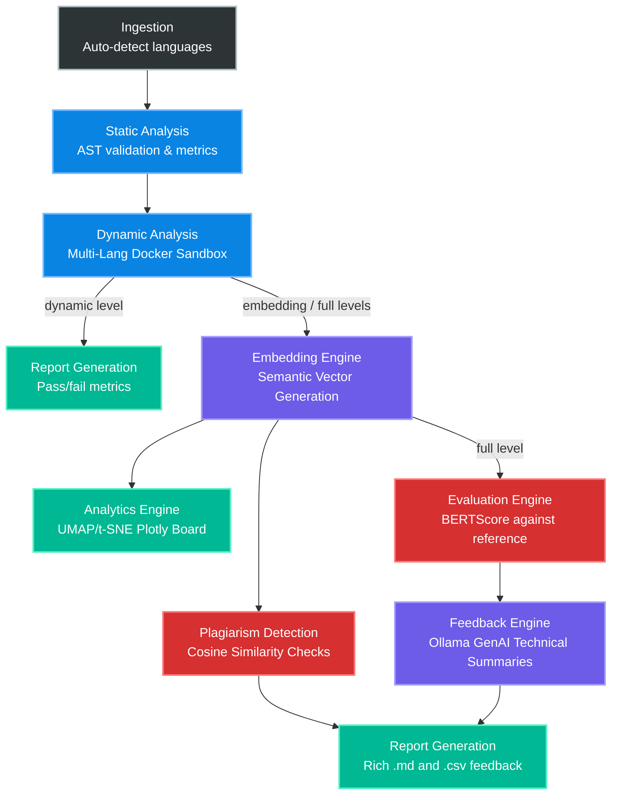

Source repository: [CodeMentor: Intelligent Script Evaluator Assisting Student Developers](https://arxiv.org/abs/2510.26402)

# CodeMentor: Intelligent Script Evaluator Assisting Student Developers

The rapid growth of programming education has outpaced traditional assessment tools, leaving faculty with limited means to provide meaningful, scalable feedback. Conventional autograders act as "black-box" systems indicating only pass/fail status. **CodeMentor** addresses this gap through two unique features: (1) generative feedback via Large Language Models (LLM) like Phi-3, and (2) interactive semantic visualizations of all student code submissions. 

By employing contrastive code embeddings, CodeMentor organizes solutions into a performance-aware space, identifying clusters of functionally similar approaches. The framework integrates a Prompt Pooling mechanism, giving instructors dynamic control over LLM feedback styles based on semantic code features. Combining AI generative feedback, multi-language Docker execution, and rich instructor analytics, CodeMentor significantly reduces evaluation workload while giving students targeted instruction to foster resilient learning.

---

### Core Features

*   **Multi-Language Support:** Natively supports **Python**, **C**, **C++**, **Java**, and **JavaScript** submissions. Uses a custom multi-language Docker image (`multilang.Dockerfile`) for secure, sandboxed execution of all supported languages.
*   **Secure & Flexible Execution:** Utilizes Docker to run student code in isolated, sandboxed environments with memory limits. Handles both full-program scripts and function-only submissions, supporting compilation (C/C++/Java) and interpretation (Python/JS) workflows.
*   **Tiered Analysis Pipeline:** Allows users to select the depth of analysis (`dynamic`, `embedding`, `full`) to balance speed with the richness of feedback.
*   **Edge Case Testing:** Supports a dedicated `edge_cases` field in assignment configs, automatically running boundary/corner-case tests alongside standard test cases with distinct reporting.
*   **Semantic Code Embeddings:** Employs models like `nomic-ai/nomic-embed-code` to convert code into meaningful vector representations, enabling quantitative analysis of solution similarity.
*   **Semantic Evaluation Engine:** A dedicated `EvaluationEngine` computes code quality metrics using both **BERTScore** (token-matching-based semantic similarity) and **Cosine Similarity** (embedding-based) against instructor-provided reference solutions.
*   **AI-Generated Pedagogical Feedback:** Leverages LLMs (e.g., Phi-3 Mini) served locally via Ollama to provide structured, human-like feedback including:
    *   **Technical Summaries** — targeted debugging hints guided by prompt pool selection.
    *   **Concept Scoring** — LLM-evaluated conceptual understanding score (0–10) with reasoning.
    *   **Auto-Fix Suggestions** — automated code fix snippets and explanations for submissions with runtime errors.
*   **Prompt Pooling Mechanism:** A curated pool of 25+ specialized prompts (covering logic, recursion, loops, data structures, error handling, OOP, etc.) that are semantically matched to student code via embedding similarity, dynamically guiding the LLM's feedback focus.
*   **Plagiarism Detection:** Pairwise cosine similarity comparison of student code embeddings with configurable threshold (default: 0.95) to flag suspected plagiarism. Alerts are included in individual reports and the analytics visualization.
*   **Instructor Analytics Dashboard:** Generates interactive UMAP/t-SNE visualizations mapping the entire class's solution space, color-coded by plagiarism flags, with hover details showing pass percentage, BERTScore similarity, concept scores, and code snippets.
*   **Fine-Tuning Capabilities:** Includes scripts for fine-tuning embedding models using advanced techniques like Multi-Label Supervised Contrastive Learning (MNR Loss, Multi-SupCon Loss) to make them "correctness-aware."

---

## Installation and Setup Guide

Follow these steps to set up and run the CodeMentor framework on your local machine.

### Step 1: Prerequisites

Before you begin, ensure you have the following software installed and configured:

1.  **Python:** Python 3.9 or higher is recommended.
2.  **Git:** For cloning the repository.
3.  **Docker:** Docker must be installed and the Docker daemon must be running.
    *   [Install Docker Engine](https://docs.docker.com/engine/install/)
    *   **Linux Users:** After installation, you must add your user to the `docker` group to run Docker commands without `sudo`.
        ```bash
        sudo usermod -aG docker $USER
        ```
        **Important:** You need to **log out and log back in** for this change to take effect. You can verify by running `docker ps`, which should execute without a permission error.
4.  **Ollama (for AI Feedback):**
    *   Ollama is required to run the generative LLMs locally. [Install Ollama](https://ollama.com/).
    *   After installation, pull the model used by the feedback engine. The default model is **Phi-3 Mini**:
        ```bash
        ollama pull phi3:mini
        ```
    *   Ensure the model tag in `src/modules/feedback_engine.py` (the `OLLAMA_MODEL_ID` variable) matches a model you have pulled. You can see your local models with `ollama list`.

### Step 2: Clone the Repository

Open your terminal and clone the project repository:

```bash
git clone https://github.com/your-username/autograder-plus.git
cd autograder-plus
```

*(Replace `your-username/autograder-plus.git` with your actual repository URL.)*

### Step 3: Set Up the Python Environment

It is strongly recommended to use a Python virtual environment to manage dependencies.

1.  **Create a virtual environment:**

    ```bash
    python3 -m venv venv
    ```

2.  **Activate the virtual environment:**

    *   On macOS / Linux:
        ```bash
        source venv/bin/activate
        ```
    *   On Windows:
        ```bash
        .\venv\Scripts\activate
        ```

3.  **Install required packages:**

    The `requirements.txt` file contains all necessary Python libraries.
    ```bash
    pip install -r requirements.txt
    ```

### Step 4: Build the Docker Images

CodeMentor uses Docker for secure code execution. Build the multi-language Docker image before running the grader:

```bash
# Multi-language image (Python, C, C++, Java, JavaScript)
docker build -f multilang.Dockerfile -t multilang-autograder:latest .

# Python-only image (lightweight alternative)
docker build -f python.Dockerfile -t python-autograder:latest .
```

> **Note:** The `multilang.Dockerfile` installs Python 3, GCC/G++, OpenJDK 17, and Node.js 18 in a single Ubuntu 22.04 container. The `dynamic_analyzer.py` expects the image tagged as `multilang-autograder:latest`.

You are now ready to use CodeMentor!

---

## Project Structure and File Descriptions

The project is organized into several key directories:

```
autograder-plus/
├── assignments/                # Assignment configurations
│   ├── hw1/
│   │   └── config.json
│   ├── hw2/
│   │   └── config.json
│   └── hw3/
│       └── config.json
├── reports/                    # Generated output reports
│   └── hwX_final/
│       ├── Report_... .md
│       ├── Summary_... .csv
│       └── interactive_embeddings_... .html
├── submissions/                # Student code submissions
│   └── hwX/
│       ├── student_id/
│       │   └── main.py (or .c, .cpp, .java, .js)
│       └── student_id.py
├── src/                        # Source code for the autograder
│   ├── __init__.py
│   ├── pipeline.py             # Main pipeline orchestrator
│   └── modules/                # All analysis and generation modules
│       ├── __init__.py
│       ├── ingestion.py
│       ├── static_analyzer.py
│       ├── dynamic_analyzer.py
│       ├── embedding_engine.py
│       ├── evaluation_engine.py
│       ├── prompt_pool.py
│       ├── feedback_engine.py
│       ├── feedback_generator.py
│       └── analytics_engine.py
├── other_module/
│   └── Contrastive_Finetune/   # Fine-tuning scripts
│       ├── fine_tune.py
│       ├── mnrloss.py
│       └── mul_supcon_loss.py
├── multilang.Dockerfile        # Multi-language Docker image (Python, C, C++, Java, JS)
├── python.Dockerfile           # Python-only Docker image
├── main.py                     # Main CLI entry point
└── requirements.txt            # Python package dependencies
```

### Key File Descriptions

*   **`main.py`**: The entry point for the application. Uses `click` to define the command-line interface and its arguments (`--level`, `--config`, etc.).

*   **`src/pipeline.py`**: The central orchestrator. Initializes all engine modules and runs the analysis pipeline in the correct sequence based on the selected `--level`. Also includes a built-in **plagiarism detection** step that performs pairwise embedding comparison across all submissions.

*   **`src/modules/`**:

    *   **`ingestion.py`**: Reads `config.json` and finds/loads student code from the submissions directory. Handles both `student_id/code.ext` and `student_id.ext` formats. Supports file extensions: `.py`, `.c`, `.cpp`, `.java`, `.js`. Automatically detects the programming language from the file extension.

    *   **`static_analyzer.py`**: Performs pre-execution checks on the code using Abstract Syntax Trees (ASTs) to find syntax errors and basic code structure metrics (loops, function definitions, etc.).

    *   **`dynamic_analyzer.py`**: The core execution engine. Uses Docker to securely run student code against test cases (including edge cases) and captures results. Supports **multi-language execution** with compilation (C/C++/Java) and interpretation (Python/JavaScript) via the `multilang-autograder` Docker image.

    *   **`embedding_engine.py`**: Loads a pre-trained or fine-tuned embedding model (e.g., `nomic-embed-code`) to convert code into semantic vectors.

    *   **`evaluation_engine.py`**: Computes semantic evaluation metrics by comparing student submissions against instructor-provided reference solutions using **BERTScore F1** and **cosine similarity** of code embeddings.

    *   **`prompt_pool.py`**: A curated collection of 25+ specialized prompts organized by category (logic, loops, recursion, data structures, error handling, OOP, etc.). Prompts are semantically matched to student code to dynamically guide the LLM's feedback.

    *   **`feedback_engine.py`**: Connects to the local Ollama server to generate rich pedagogical feedback. Produces: (1) a **technical summary** (targeted debugging hint), (2) a **concept score** (0–10 with reasoning), and (3) an **auto-fix suggestion** when runtime errors are detected.

    *   **`feedback_generator.py`**: Consumes results from all analysis stages and generates final reports — aggregated Markdown (`.md`) and summary CSV (`.csv`) — including edge case results, AI evaluation scores, and plagiarism alerts.

    *   **`analytics_engine.py`**: Takes embeddings from all students, performs UMAP (or t-SNE fallback) dimensionality reduction, and generates an interactive Plotly (`.html`) visualization with plagiarism flags, BERTScore similarity, concept scores, and code snippets on hover.

*   **`other_module/Contrastive_Finetune/`**: Contains standalone scripts for advanced users to fine-tune embedding models on custom datasets using **MNR Loss** and **Multi-Label Supervised Contrastive Loss**.

*   **`assignments/`**: Instructors place their `config.json` files here to define new assignments, including test cases, edge cases, and reference solutions.

*   **`submissions/`**: Student code should be placed here, following the structure defined for the assignment. Supports `.py`, `.c`, `.cpp`, `.java`, and `.js` files.

*   **`reports/`**: All output files are saved here by default.

---

## Assignment Configuration

Each assignment is defined via a `config.json` file. Example for a Python assignment:

```json
{
    "assignment_id": "hw3",
    "name": "Prime Number Checker",
    "description": "Write a function 'is_prime(n)' that returns True if n is prime.",
    "language": "python",
    "test_cases": [
        { "name": "composite_low", "input": "4", "expected_output": "False" },
        { "name": "prime_high", "input": "17", "expected_output": "True" }
    ],
    "edge_cases": [
        { "name": "prime_edge_2", "input": "2", "expected_output": "True" },
        { "name": "negative_number", "input": "-5", "expected_output": "False" },
        { "name": "zero_case", "input": "0", "expected_output": "False" }
    ],
    "reference_solution": "def is_prime(n):\n    if n < 2: return False\n    for i in range(2, int(n**0.5) + 1):\n        if n % i == 0: return False\n    return True"
}
```

| Field | Description |
|-------|-------------|
| `assignment_id` | Unique identifier for the assignment |
| `name` | Human-readable name |
| `test_cases` | Standard test inputs and expected outputs |
| `edge_cases` | Boundary/corner-case tests (reported separately) |
| `reference_solution` | Instructor's reference code for BERTScore and cosine similarity evaluation |
| `execution_mode` | (Optional) `{"type": "program"}` or `{"type": "function", "entry_point": "func_name"}` |

---

## Usage

Run the autograder from the root directory of the project.

### Command Structure

```bash
python main.py grade --level <LEVEL> --assignment-config <PATH> --submissions-dir <PATH> --output-dir <PATH>
```

### Analysis Levels

| Level | Stages Executed | Description |
|-------|----------------|-------------|
| `dynamic` | Static Analysis → Dynamic Testing | Fastest mode. Classic autograder — correctness check only. |
| `embedding` | Static → Dynamic → Embedding → Analytics | Adds semantic embeddings, plagiarism detection, and UMAP visualization. |
| `full` | Static → Dynamic → Embedding → Evaluation → Feedback → Analytics | Full pipeline with BERTScore evaluation, LLM feedback, concept scoring, auto-fix, and plagiarism detection. |

### Examples

**Run the Full Pipeline (Default)**

Runs all stages including dynamic tests, embeddings, BERTScore evaluation, AI feedback, and analytics generation.

```bash
python main.py grade \
    --assignment-config ./assignments/hw3/config.json \
    --submissions-dir ./submissions/hw3/ \
    --output-dir ./reports/hw3_full_run
```

**Run for Analytics Only**

Faster mode — skips the LLM feedback stage. Generates embeddings, plagiarism detection, and the UMAP plot.

```bash
python main.py grade --level embedding \
    --assignment-config ./assignments/hw2/config.json \
    --submissions-dir ./submissions/hw2/ \
    --output-dir ./reports/hw2_embedding_run
```

**Run for Quick Correctness Check**

Fastest mode — runs only static analysis and dynamic testing (no AI, no embeddings).

```bash
python main.py grade --level dynamic \
    --assignment-config ./assignments/hw1/config.json \
    --submissions-dir ./submissions/hw1/ \
    --output-dir ./reports/hw1_dynamic_only
```

---

## Pipeline Architecture

The processing pipeline is modular, executing different stages depending on the `--level` flag.



---

## Generated Output

The framework produces three types of output in the specified `--output-dir`:

1.  **`Report_<assignment_id>.md`** — Aggregated Markdown report with per-student sections containing:
    - Static analysis results
    - Test case results (standard + edge cases)
    - BERTScore semantic similarity
    - Concept understanding score (0–10) with reasoning
    - AI-generated technical summary and debugging hints
    - Auto-fix suggestions (when applicable)
    - Plagiarism alerts

2.  **`Summary_<assignment_id>.csv`** — CSV spreadsheet with columns: `student_id`, `tests_passed`, `tests_total`, `score_percentage`, `bert_similarity`, `concept_score`, `semantic_summary`.

3.  **`interactive_embeddings_<assignment_id>_umap.html`** — Interactive Plotly scatter plot visualizing the class's solution space with hover details and plagiarism flags.

---

## Supported Languages

| Language | File Extension | Execution | Docker Image |
|----------|---------------|-----------|--------------|
| Python | `.py` | Interpreted (`python3`) | `multilang-autograder` |
| C | `.c` | Compiled (`gcc`) | `multilang-autograder` |
| C++ | `.cpp` | Compiled (`g++`) | `multilang-autograder` |
| Java | `.java` | Compiled (`javac` + `java`) | `multilang-autograder` |
| JavaScript | `.js` | Interpreted (`node`) | `multilang-autograder` |

---

## License

See [LICENSE](LICENSE) for details.
